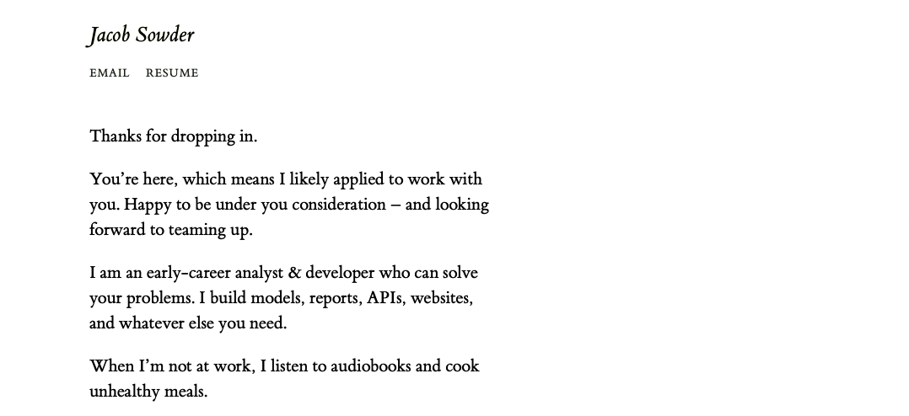

# Website

Hello there, welcome to my site's source code!

[The site](https://www.jacobsowder.com/?utm_source=github) houses a simple welcome page, my email, and my resume. Soon I might add a longer "about me" page -- but isn't that what a resume is for?

It's powered by [Hugo](https://gohugo.io) and uses a [customized theme](https://github.com/jsowder/hugo-envisioned). I don't have a strong interest in blogging right now, but it has that capacity if I have a stroke of inspiration.

How it looks:

